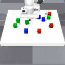

# Entity-Centric Reinforcement Learning (ECRL)

Official PyTorch code release of the paper "*Entity-Centric Reinforcement Learning for Object Manipulation from Pixels*" by Dan Haramati,
Tal Daniel and Aviv Tamar.

<h1 align="center">
   
	Entity-Centric Reinforcement Learning for Object Manipulation from Pixels
   
</h1>
  <h3 align="center">
    <a href="https://www.linkedin.com/in/dan-haramati/">Dan Haramati</a> •
    <a href="https://taldatech.github.io">Tal Daniel</a> •
    <a href="https://avivt.github.io/avivt/">Aviv Tamar</a>
  </h3>

<h3 align="center">ICLR 2024 - Spotlight (top 5%)</h3>
<h4 align="center">Goal-Conditioned Reinforcement Learning Workshop, NeurIPS 2023 - Spotlight</h4>

<h4 align="center">
    <a href="https://sites.google.com/view/entity-centric-rl/ecrl">Project Website</a> •
    <a href="https://arxiv.org/abs/2404.01220">arXiv</a> •
    <a href="https://openreview.net/forum?id=uDxeSZ1wdI">OpenReview</a>
</h4>

<h6 align="center">Zero-Shot Generalization from 3 to 12 Objects</h6>

   &nbsp; &nbsp;
   &nbsp; &nbsp;
  

> **Abstract** 
>
> *Manipulating objects is a hallmark of human intelligence, and an important task in domains such as robotics.
> In principle, Reinforcement Learning (RL) offers a general approach to learn object manipulation.
> In practice, however, domains with more than a few objects are difficult for RL agents due to the curse of dimensionality,
> especially when learning from raw image observations.
> In this work we propose a structured approach for visual RL that is suitable for representing multiple objects and their interaction,
> and use it to learn goal-conditioned manipulation of several objects.
> Key to our method is the ability to handle goals with dependencies between the objects (e.g., moving objects in a certain order).
> We further relate our architecture to the generalization capability of the trained agent, based on a theoretical result for compositional generalization,
> and demonstrate agents that learn with 3 objects but generalize to similar tasks with over 10 objects.*

## Citation

Haramati, Dan, Tal Daniel, and Aviv Tamar. "Entity-Centric Reinforcement Learning for Object Manipulation from Pixels." Proceedings of the Twelfth International Conference on Learning Representations (ICLR). 2024.
>	
     @inproceedings{
     haramati2024entitycentric,
     title={Entity-Centric Reinforcement Learning for Object Manipulation from Pixels},
     author={Dan Haramati and Tal Daniel and Aviv Tamar},
     booktitle={The Twelfth International Conference on Learning Representations},
     year={2024},
     url={https://openreview.net/forum?id=uDxeSZ1wdI}
     }

<h6 align="center">In the Eyes of the Agent</h6>

   &nbsp; &nbsp;
   &nbsp; &nbsp;
   &nbsp; &nbsp;
  

### Content

[Entity Centric-Reinforcement Learning (ECRL)](#entity-centric-reinforcement-learning-ecrl)
  1. [Prerequisites](#1-prerequisites)
  2. [Environments](#2-environments)
  3. [Training](#3-training)
     - [Deep Latent Particles (DLP) Pretraining](#deep-latent-particles-dlp-pretraining)
     - [RL Training](#rl-training)
  4. [Evaluation](#4-evaluation)
  5. [Repository Content Details](#5-repository-content-details)
  6. [Credits](#6-credits)

## 1. Prerequisites

The following are the main libraries required to run this code:

| Library             | Version |
|---------------------|---------|
| `Python`            | `3.8`   |
| `torch`             | `2.1.2` |
| `stable-baselines3` | `1.5.0` |
| `isaacgym`          |         |

For the full list of requirements, see the `requirements.txt` file.

For the simulation environment, download the Isaac Gym Preview release from the [website](https://developer.nvidia.com/isaac-gym), then
follow the installation instructions in the documentation.

## 2. Environments

<h6 align="center">Environments</h6>

  

The above figure describes the suite of training environments used in the paper.

`N-Cubes`: Push N different-colored cubes to their goal location. \
`Adjacent-Goals`: A `3-Cubes` setting where goals are sampled randomly on the table such that all cubes are adjacent.
This task requires accounting for interactions between objects. \
`Ordered-Push`: A `2-Cubes` setting where a narrow corridor is set on top of the table such that its width can only fit a single cube.
We consider two possible goal configurations: red cube in the rear of the corridor and green cube in the front, or vice versa.
This task requires to fulfill the goals in a certain order, otherwise the agent fails (pulling a block out of the corridor is not possible). \
`Small-Table`: A `3-Cubes` setting where the table is substantially smaller.
This task requires to accurately account for all objects in the scene at all times, to avoid pushing blocks off the table. \
`Push-2T`: Push 2 T-shaped blocks to a single goal **orientation**.

A configuration file for each environment, `IsaacPandaPushConfig.yaml`, is provided in the corresponding directory in `config`.

## 3. Training

### Deep Latent Particles (DLP) Pretraining

We provide pretrained model checkpoints:

| Model          | Dataset                  | Download                                                                          |
|----------------|--------------------------|-----------------------------------------------------------------------------------|
| DLP            | `5-Cubes`                | [Google Drive](https://drive.google.com/uc?id=1CZM9juLndBFyehxTnP5frPr07FFnVvot)  |
| DLP            | `6-Cubes`                | [Google Drive](https://drive.google.com/uc?id=1KP_KP4-kjy801b9VuG9CK8Y3oc-opUgf)  |
| DLP            | `Push-T`                 | [Google Drive](https://drive.google.com/uc?id=1DH3ut9BVkAfXRfwIAboEo_FmhZRJejRf)  |
| Slot-Attention | `5-Cubes`                | [Google Drive](https://drive.google.com/uc?id=1Ex3GwF7TtcuYsxnFNQXB_Ktj2daiVzQt)  |
| VAE            | Mixture of `1/2/3-Cubes` | [Google Drive](https://drive.google.com/uc?id=1Tyex8k0XTd42Vndh0hDnK43isXw0BDa0)  |

Download and place in the relevant directory in `latent_rep_chkpts`
(e.g., checkpoint of DLP trained on data from the `5-Cubes` environment should be placed in `latent_rep_chkpts/dlp_push_5C`).

In order to retrain the model:
1. Collect image data using a random policy by running `main.py -c <configuration_dir>` with the desired environment (e.g, `main.py -c config/n_cubes`), setting `collectData: True`
and `collectDataNumTimesteps` in the relevant `Config.yaml`. This will save a `.npy` file in the `results` directory.
2. Process the data into a dataset by running `dlp2/datasets/process_dlp_data.py` (fill in the relevant paths in the beginning of the script).
3. Configure `config/TrainDLPConfig.yaml` and run `train_dlp.py`.

<h6 align="center">DLP Decomposition</h6>

  

### RL Training

Run `main.py -c <configuration_dir>` with the desired configuration (e.g, `main.py -c config/n_cubes`). \
`Config.yaml` contains agent and training parameters and `IsaacPandaPushConfig.yaml` contains environment parameters. \
\
In order to reproduce the experiments in the paper, input the corresponding configuration directory.
The configurations are already set to match the ones used in the paper.
The parameters requiring configuration for the different instances of the experiments (e.g, 'State' or 'Image'):
- In `Config.yaml` the `Model` parameters.
- In `IsaacPandaPushConfig.yaml` the `numObjects` parameter (for n_cubes and push_t).

To log training statistics and images/videos using [Weights & Biases](https://wandb.ai/site) set `WANDB: log: True` in `Config.yaml`
and fill in your username in the `wandb.init(entity="")` line in the `main.py` script.

Agent model checkpoints and intermediate results are saved in the `model_chkpts` and `results` directories respectively.

<h6 align="center">EIT Architecture Outline</h6>

  

## 4. Evaluation

To evaluate an agent on a given environment, run `policy_eval.py`.
Set the agent model_path and the desired configuration directory manually in the beginning of the script.

**Evaluation on Zero-Shot Generalization**

_Cube Sorting_: train on `config/n_cubes` with `numObjects: 3` and evaluate on `config/generalization_sort_push`.

_Different Number of Cubes than in Training_: train on `config/generalization_num_cubes` with `numObjects: 3` and evaluate with same config and varying number of objects.

<h6 align="center">Zero-Shot Generalization from 3 to 6 Objects</h6>

   &nbsp; &nbsp;
   &nbsp; &nbsp;
  
   &nbsp; &nbsp;

## 5. Repository Content Details
| Filename                     | Description                                                             |
|------------------------------|-------------------------------------------------------------------------|
| `main.py`                    | main script for training the RL agent                                   |
| `policy_eval.py`             | script for evaluating a trained agent on a given environment            |
| `td3_agent.py`               | agent code implementing TD3 + HER with adjustments                      |
| `multi_her_replay_buffer.py` | SB3 HER replay buffer adjusted for data from parallel environments      |
| `policies.py`                | policy and Q-function neural networks for ECRL and baselines            |
| `isaac_env_wrappers.py`      | wrappers for the IsaacGym environment for SB3 and goal compatibility    |
| `isaac_panda_push_env.py`    | IsaacGym-based tabletop robotic pushing environment                     |
| `/panda_controller`          | directory containing code for the robotic arm controller                |
| `isaac_vec_env.py`           | base IsaacGym environment                                               |
| `chamfer_reward.py`          | Chamfer reward model                                                    |
| `latent_classifier.py`       | latent binary classifier for the Chamfer Reward filter                  |
| `utils.py`                   | utility functions                                                       |
| `/dlp2`                      | directory containing the DLP code                                       |
| `train_dlp.py`               | script for pretraining a DLP model                                      |
| `/vae`                       | directory containing the VAE code for the unstructured baseline         |
| `train_vae.py`               | script for pretraining a VAE model (with VQ-VAE option)                 |
| `/slot_attention`            | directory containing the Slot-Attention code                            |
| `train_sa.py`                | script for pretraining a Slot-Attention model (with SLATE option)       |
| `/latent_rep_chkpts`         | directory containing pre-trained representation model checkpoints       |
| `/latent_classifier_chkpts`  | directory containing trained classifiers for the Chamfer Reward         |
| `/assets`                    | IsaacGym environment assets                                             |
| `/config`                    | directory containing configuration files for the different environments |
| `requirements.txt`           | library requirements file                                               |
| `/media`                     | directory containing images and gifs for this README                    |

`isaac_env_wrappers.py`, `isaac_panda_push_env.py`, and `chamfer_reward.py` contain scripts for debugging the components seperately. \
`latent_classifier.py` contains an interactive script for tagging data and training the classifier.

## 6. Credits
* Environments adapted from the [IsaacGymEnvs](https://github.com/NVIDIA-Omniverse/IsaacGymEnvs/) FrankaCubeStack environment.
* Controller for the Franka Panda arm adapted from the OSC implementation of [OSCAR](https://github.com/NVlabs/oscar).
* RL code modified from [SB3](https://github.com/DLR-RM/stable-baselines3) (mainly from the TD3 agent and HERReplayBuffer).
* Entity Interaction Transformer (EIT) code built from components adapted from the [DDLP](https://github.com/taldatech/ddlp) Particle Interaction Transformer (PINT)
which is based on [minGPT](https://github.com/karpathy/minGPT).
* SMORL re-implementation based on the [official repository](https://github.com/martius-lab/SMORL) of the paper using the same codebase as the EIT.
* DLP code modified from the official implementation of DLPv2 in the [DDLP](https://github.com/taldatech/ddlp) repository.
* VAE code modified from [Taming Transformers](https://github.com/CompVis/taming-transformers/).
* Slot-Attention code modified from [Object Discovery PyTorch](https://github.com/HHousen/object-discovery-pytorch).